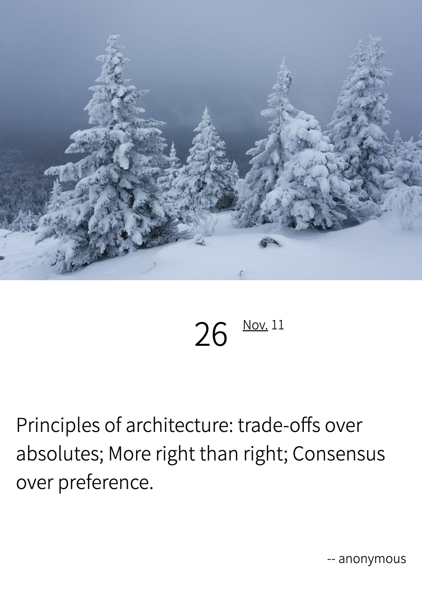

# html-poster
A poster maker by html template.

## usage

> git clone https://github.com/linksgo2011/html-poster.git

> cd html-poster

> node bin/index.js -t default -p '{"author":"anonymous","content":"Principles of architecture: trade-offs over absolutes; More right than right; Consensus over preference."}'

or you can: 

> npm install -g .

> htmlposter -t default -p '{"author":"anonymous","content":"Principles of architecture: trade-offs over absolutes; More right than right; Consensus over preference."}'

## demo

## reference

- https://ejs.co/#install
- command-line-app-with-nodejs https://developer.okta.com/blog/2019/06/18/command-line-app-with-nodejs
